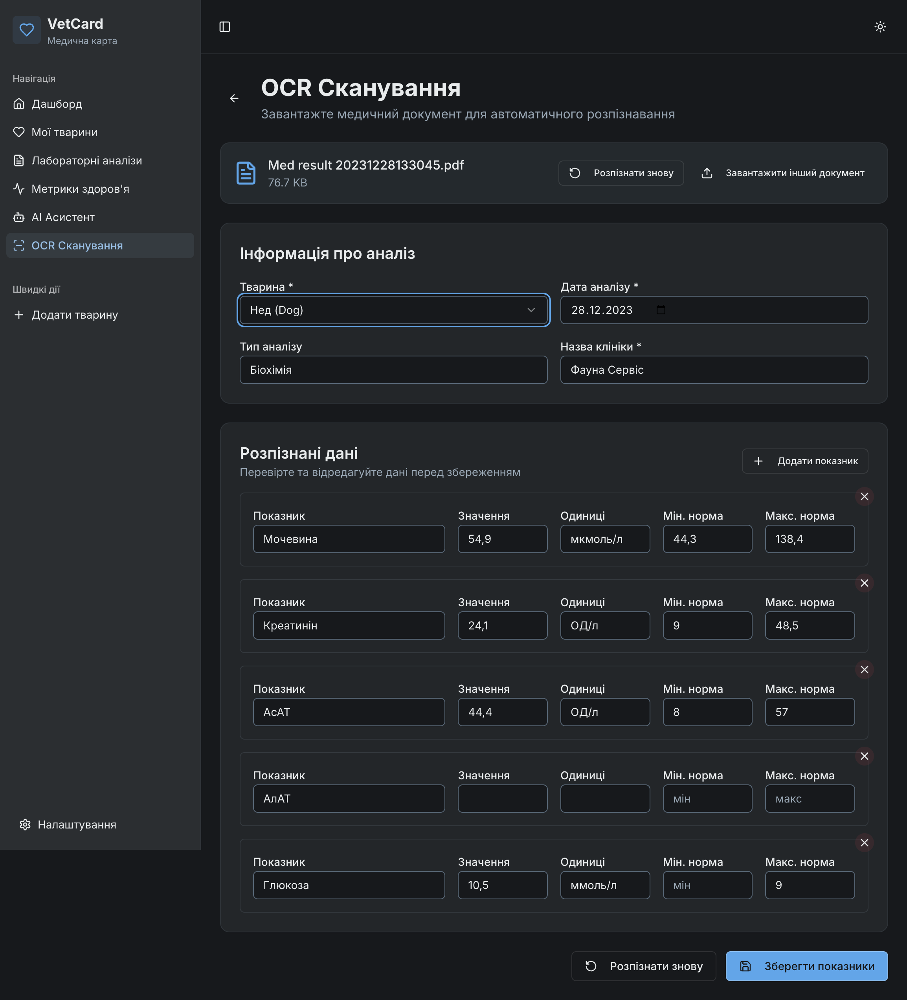
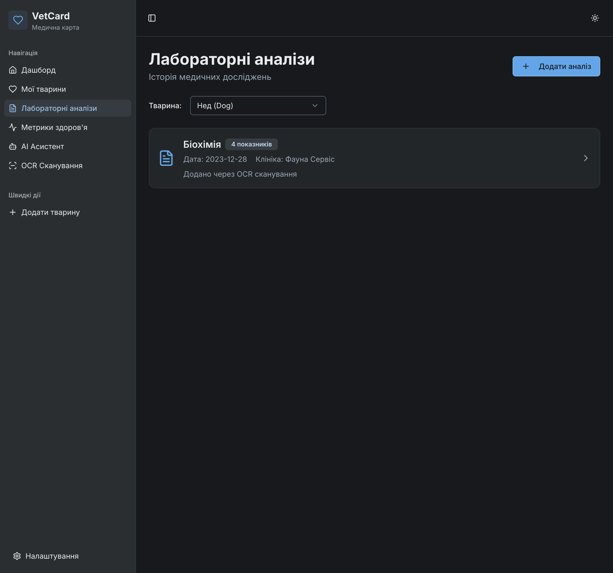
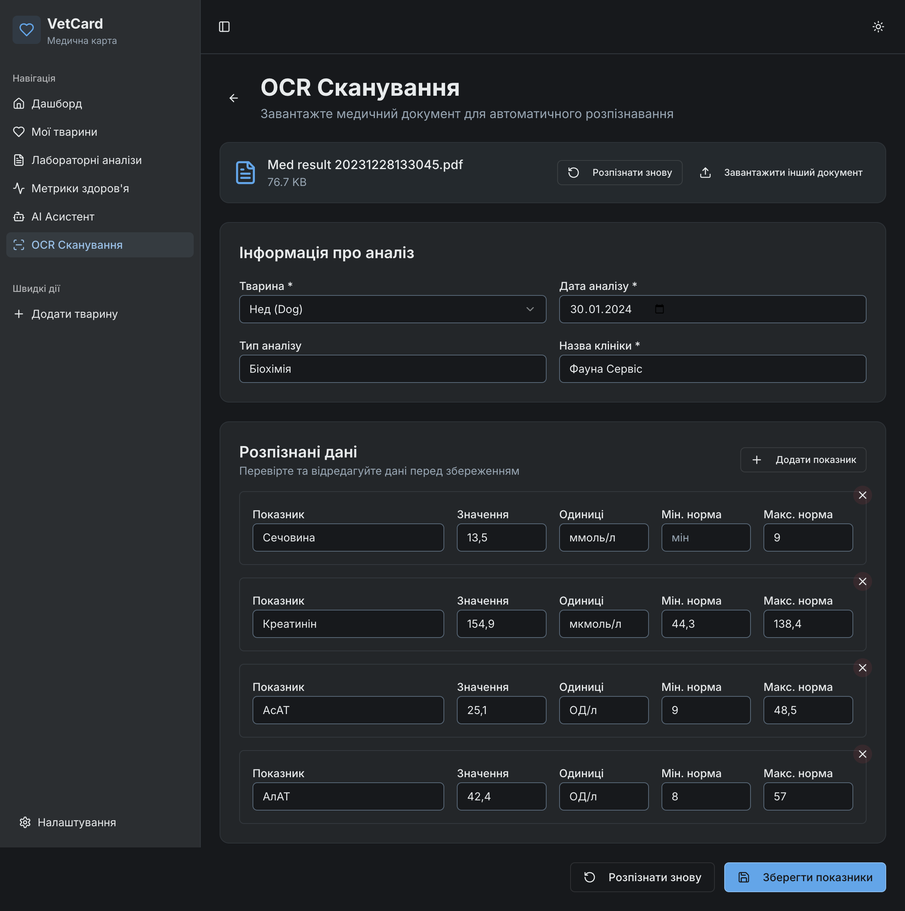
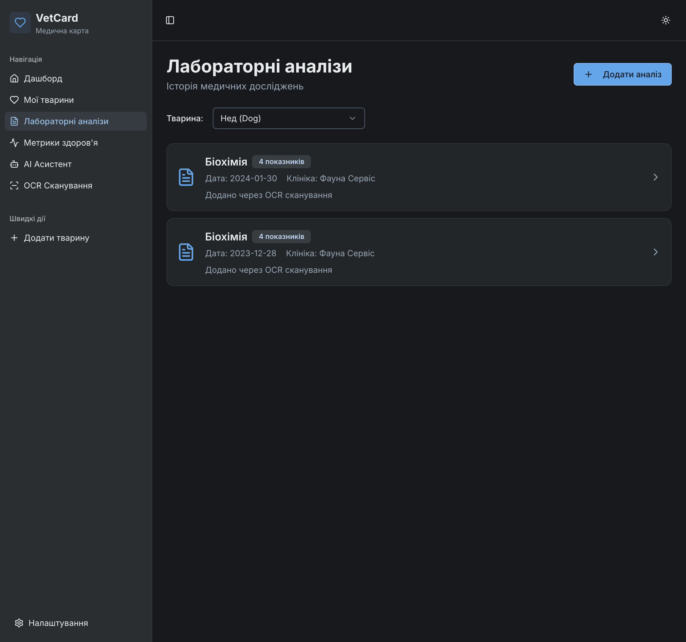
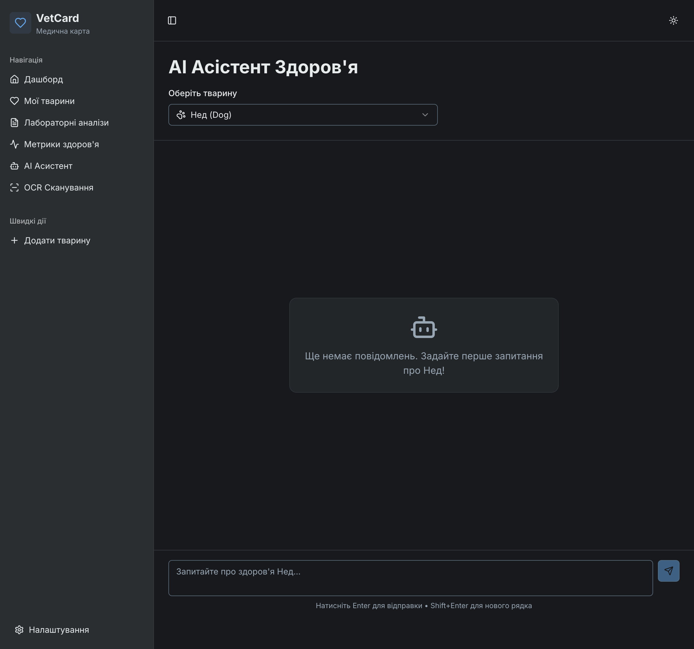
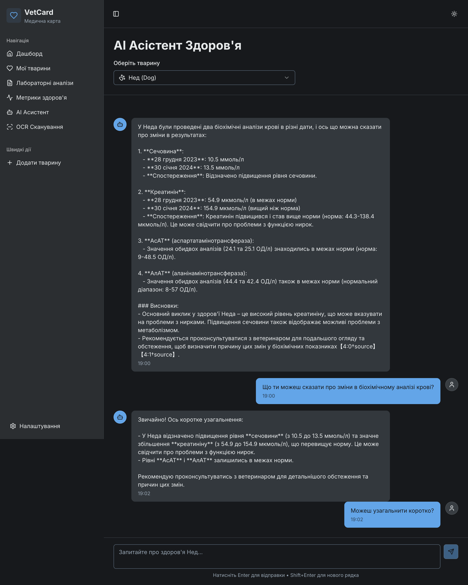
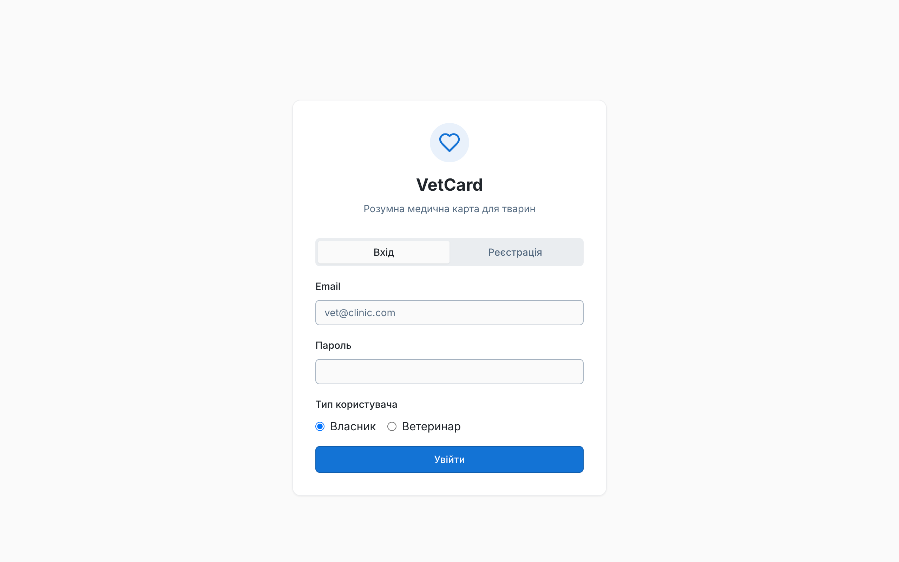
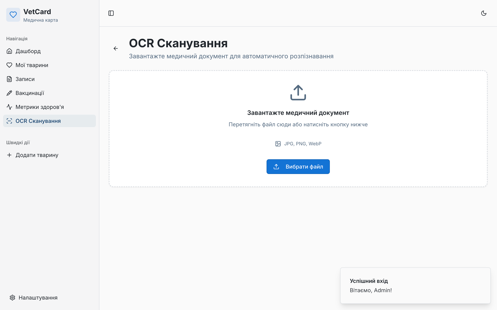
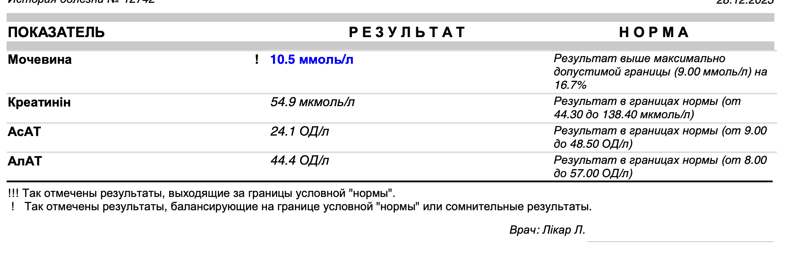
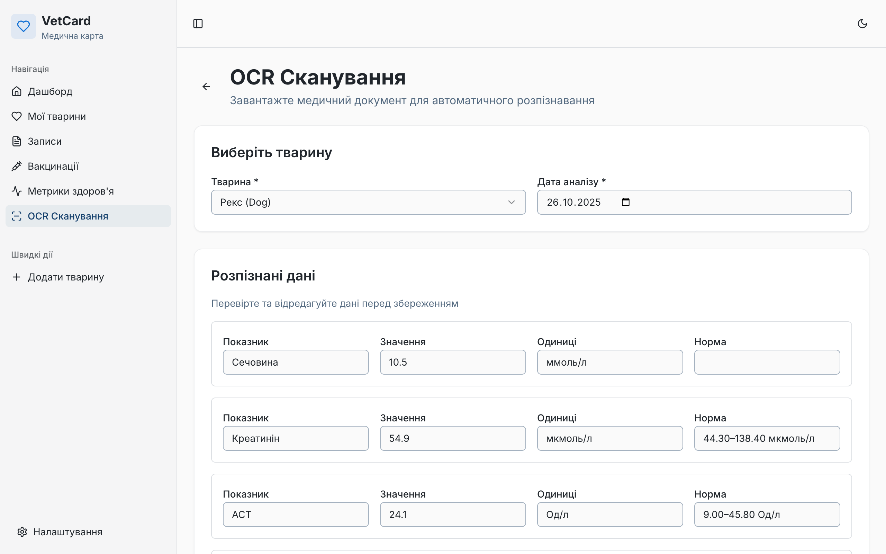

## 🧠 Звіт за 02.11.2025 — Додано AI Асистент Здоров’я

### 🔹 Новий функціонал
- **AI Асистент Здоров’я (RAG-Chat):**
  - Повноцінна інтеграція асистента для аналізу результатів біохімічних аналізів тварин.
  - Асистент має доступ до всієї історії лабораторних досліджень конкретної тварини.
  - Виявляє зміни у показниках між різними датами (підвищення/зниження).
  - Формує зрозумілі висновки та коротке резюме (“tl;dr”) українською.
  - Підтримує контекстні запити, наприклад: _«порівняй останні два аналізи»_, _«які показники виходять за межі норми»_.

### 🔹 Оновлення UI
- Додано окрему сторінку **AI Асистент**, доступну з бокового меню.  
- Інтерфейс чату підтримує:
  - вибір тварини з історією аналізів;
  - автоматичне прокручування до останніх повідомлень;
  - індикатор очікування відповіді;
  - історію повідомлень із відмінністю між користувачем та асистентом;
  - темну тему для комфортної роботи.

---

### 📸 Приклади з поточного релізу

| № | Зображення | Опис |
|---|-------------|------|
| 1 |  | Завантаження PDF-документа з результатами аналізу, автоматичне розпізнавання метрик за допомогою OCR. |
| 2 |  | Відображення збереженого аналізу в списку лабораторних досліджень із деталями по даті, клініці та типу тесту. |
| 3 |  | Повторне сканування іншого біохімічного аналізу тієї ж тварини для подальшого порівняння. |
| 4 |  | У списку лабораторних тестів тепер видно два аналізи з різними датами — база даних оновлюється автоматично. |
| 5 |  | Сторінка “AI Асистент” із вибором тварини та історією чату, де асистент аналізує результати аналізів. |
| 6 |  | Приклад згенерованої відповіді: асистент формує висновки з біохімічного аналізу та виявляє ключові зміни. |

---

### 🔹 Технічні оновлення
- **ChatService:** реалізовано повну логіку RAG-асистента — збереження історії, відновлення контексту, зв’язок із конкретною твариною.  
- **Vector Store:** кожен лабораторний аналіз тепер зберігається як окремий файл-контекст у векторному сховищі.  
- **Frontend:** новий маршрут `/ai-assistant`, інтегрований із React Query для запитів і кешування історії повідомлень.  
- **Backend:** розширено `/api/chat/:animalId` для обробки контекстних запитів; реалізовано rollback при помилках.  
- **UI:** оновлено навігацію (додано “AI Асистент”) і оптимізовано структуру Sidebar.

---

### 🔹 Висновок
Система **VetCard** тепер повністю охоплює повний цикл роботи з даними аналізів:
1. OCR-сканування та розпізнавання результатів.  
2. Збереження лабораторних тестів і перегляд історії.  
3. **AI-аналіз змін і формування медичних висновків.**

---

## Стан розробки (станом на 26.10.2025)

На даний момент завершено розробку базового функціоналу для розпізнованню зображень результатів аналізів, орієнтованого на **Власника тварини**

### ✅ Що вже готово:

* **Автентифікація та API:** Робочий backend API (Express, Drizzle) з автентифікацією, валідацією та CRUD-операціями.
* **Базовий флоу Власника:** Реалізовано реєстрацію, вхід, створення/редагування тварин (`PetsList`) та перегляд детального профілю (`PetDetail`).
* **Медичні модулі:** Функціональні сторінки:
    * `VetRecords`: Додавання та перегляд медичних записів.
    * `HealthMetrics`: Відображення показників здоров'я
* **AI (OCR) Модуль:** Сторінка "Scan" інтегрована з **OpenAI Vision API (gpt-5)**.
    * Підтримує завантаження зображень (JPEG, PNG, WebP).
    * Автоматично розпізнає метрики та виводить їх у таблицю для редагування.
    * Протестовано на реальних ветеринарних аналізах крові.
* **Технічна база:** Налаштовано React Query для кешування, bcrypt для безпеки та UI-систему на базі shadcn/ui.

## Screenshots

### 1. Автентифікація

*Сторінка входу та реєстрації з вибором типу користувача (Власник або Ветеринар).*

### 2. Панель інструментів

*Головна панель власника тварини у початковому стані, готова до додавання тварин.*

### 3. Створення тварини

*Форма додавання детальної інформації про нову тварину.*

### 4. Функція OCR (Сканування)

*Сторінка "OCR Сканування" з формою для завантаження медичного документа.*

*Приклад реального медичного документа (аналізу крові), що використовується для сканування.*

*Індикатор завантаження під час аналізу документа за допомогою OpenAI Vision API.*

*Результати OCR-розпізнавання, представлені у формі для верифікації та редагування користувачем.*

### 5. Метрики Здоров'я

*Сторінка "Метрики здоров'я", що відображає збережені показники аналізів після OCR-сканування.*