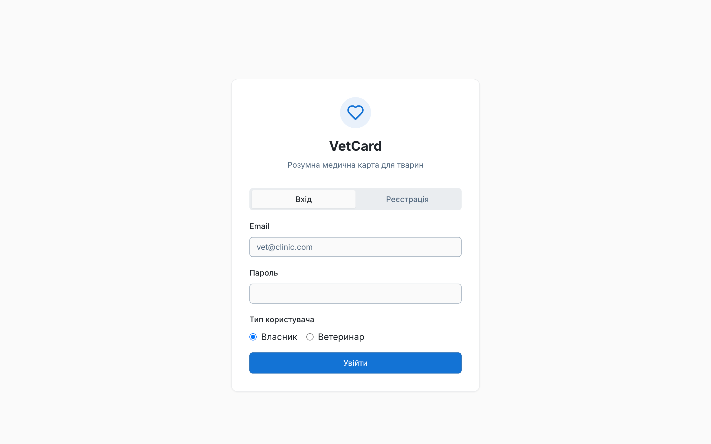
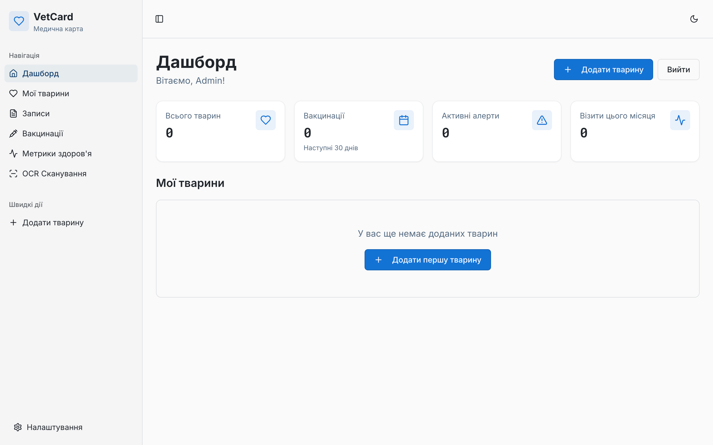
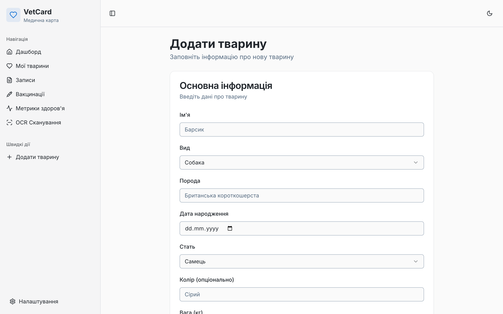
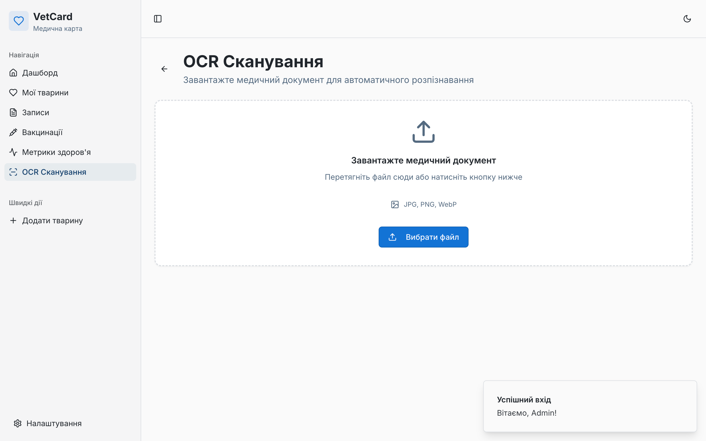
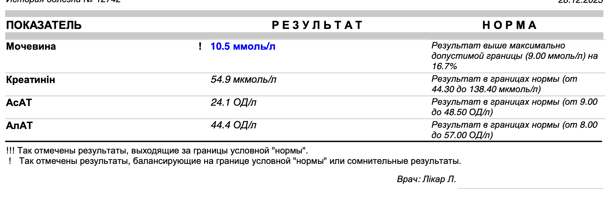
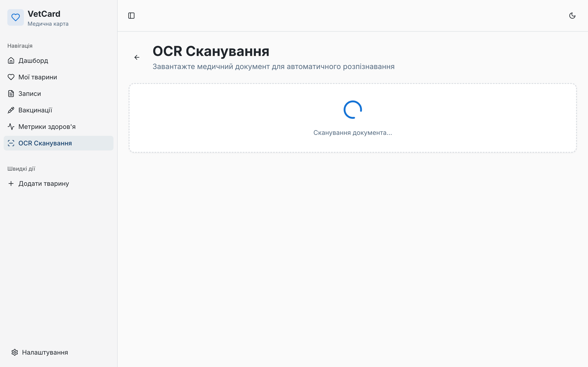
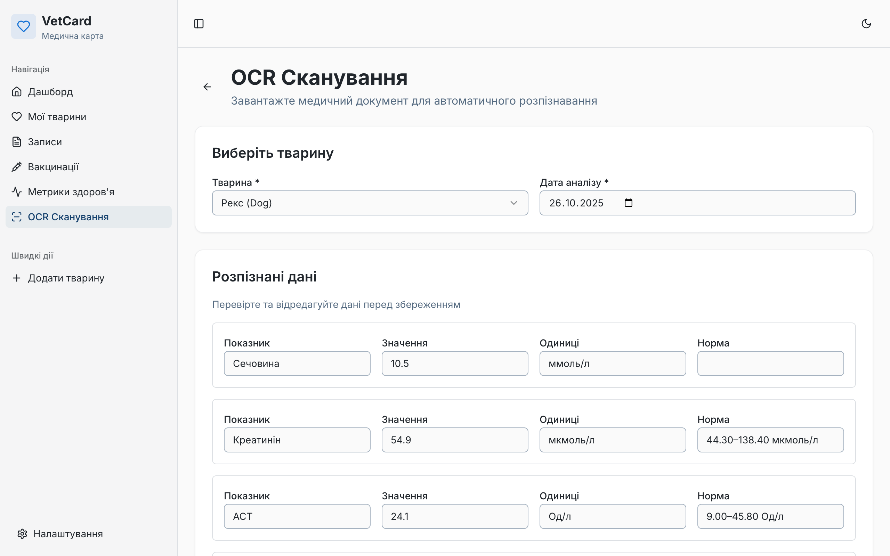
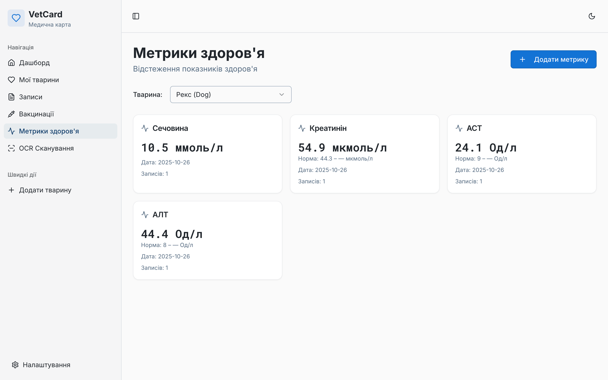

## Стан розробки (станом на 26.10.2025)

На даний момент завершено розробку базового функціоналу для розпізнованню зображень результатів аналізів, орієнтованого на **Власника тварини**

### ✅ Що вже готово:

* **Автентифікація та API:** Робочий backend API (Express, Drizzle) з автентифікацією, валідацією та CRUD-операціями.
* **Базовий флоу Власника:** Реалізовано реєстрацію, вхід, створення/редагування тварин (`PetsList`) та перегляд детального профілю (`PetDetail`).
* **Медичні модулі:** Функціональні сторінки:
    * `VetRecords`: Додавання та перегляд медичних записів.
    * `HealthMetrics`: Відображення показників здоров'я
* **AI (OCR) Модуль:** Сторінка "Scan" інтегрована з **OpenAI Vision API (gpt-5)**.
    * Підтримує завантаження зображень (JPEG, PNG, WebP).
    * Автоматично розпізнає метрики та виводить їх у таблицю для редагування.
    * Протестовано на реальних ветеринарних аналізах крові.
* **Технічна база:** Налаштовано React Query для кешування, bcrypt для безпеки та UI-систему на базі shadcn/ui.

## Screenshots

### 1. Автентифікація

*Сторінка входу та реєстрації з вибором типу користувача (Власник або Ветеринар).*

### 2. Панель інструментів

*Головна панель власника тварини у початковому стані, готова до додавання тварин.*

### 3. Створення тварини

*Форма додавання детальної інформації про нову тварину.*

### 4. Функція OCR (Сканування)

*Сторінка "OCR Сканування" з формою для завантаження медичного документа.*

*Приклад реального медичного документа (аналізу крові), що використовується для сканування.*

*Індикатор завантаження під час аналізу документа за допомогою OpenAI Vision API.*

*Результати OCR-розпізнавання, представлені у формі для верифікації та редагування користувачем.*

### 5. Метрики Здоров'я

*Сторінка "Метрики здоров'я", що відображає збережені показники аналізів після OCR-сканування.*